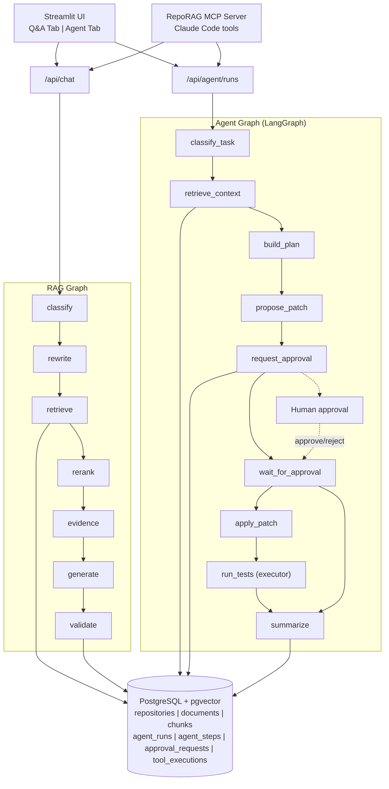

# RepoRAG

[中文文档](README.zh.md) | [English](README.md)

A GitHub repository RAG assistant with an agentic code maintenance workbench — source-grounded answers, hybrid retrieval, LangGraph agent orchestration, human-in-the-loop approvals, sandboxed execution, MCP tools, and trajectory-based evaluation.

## Core Features

### RAG Engine (Phase 1-4)
- **Code-aware chunking** — Markdown by headings, Python by AST functions/classes, JS/TS by regex fallback; preserves line numbers and commit SHAs
- **Hybrid retrieval** — vector (pgvector) + keyword (PostgreSQL full-text search) with Reciprocal Rank Fusion
- **Citation validation** — every answer includes GitHub permalinks with file paths and line ranges; fabricated citations detected and stripped
- **LangGraph RAG pipeline** — question classification → query rewrite → hybrid retrieval → rerank → evidence check → generate → validate

### Agentic Extension (Phase 1-7)
- **LangGraph agent workflow** — classify task → retrieve context → build plan → propose patch → request approval → apply/run tests → summarize
- **Human-in-the-loop approvals** — high-risk actions (apply_patch, run_command, create_pr) require explicit approval
- **Security guards** — CommandGuard (allowlist: pytest/ruff/python; blocks rm/sudo/curl/ssh + shell metacharacters), PathGuard (blocks .env/.git/credentials + parent traversal)
- **Safe execution** — `subprocess.run` without `shell=True`, 60s timeout, stdout/stderr capture, ToolExecution audit log
- **Patch proposal** — LLM generates unified diffs, auto-validated for diff format correctness
- **MCP server** — 4 tools (search_code, create_agent_run, get_agent_run, resolve_approval) for Claude Code integration
- **Agent evaluation** — plan_success, context_hit_rate, approval_accuracy, patch_validity, latency

## Architecture



## Agent Workflow (LangGraph)

```
classify_task ──► retrieve_context ──► build_plan
                                          │
                   plan_only ──► summarize ◄── approved/rejected
                   propose_patch / execute ──► propose_patch
                                                  │
                                            request_approval
                                                  │
                              not_required ──► summarize
                              pending ──► wait_for_approval ──► END
                              approved ──► apply_patch ──► run_tests ──► summarize
```

## Safety and Approval Model

| Risk Level | Examples | Requires Approval |
|------------|----------|-------------------|
| Low | read-only retrieval, list repos | No |
| Medium | pytest, ruff check | Yes (in execute mode) |
| High | apply patch, rm, curl, git push, create PR | Yes |

**CommandGuard blocks**: `rm`, `sudo`, `curl`, `wget`, `ssh`, `nc`, `chmod`, `chown`, `git push`, `git reset --hard`, shell metacharacters (`|`, `;`, `&&`, `$()`, `` ` ``, `>`, `<`)

**PathGuard blocks**: `.env`, `.git/`, credentials files, parent traversal (`..`)

## Tech Stack

| Layer | Technology |
|-------|-----------|
| Backend | Python 3.11+, FastAPI |
| RAG/Agent | LangChain (langchain-openai, langchain-core), LangGraph |
| Database | PostgreSQL + pgvector (+ full-text search) |
| Frontend | Streamlit (Q&A + Agent tabs) |
| LLM | DeepSeek V4 (OpenAI-compatible, swappable) |
| Embeddings | OpenAI-compatible provider (swappable) |
| MCP | FastMCP (Python >=3.10) |
| Dev tools | pytest (159 tests), ruff, Alembic |

## Quick Start

```bash
git clone https://github.com/ZedingZhang/reporag.git
cd reporag
cp .env.example .env           # edit with your API keys
docker compose up --build       # auto-runs migrations
```

- FastAPI docs: http://localhost:8000/docs
- Streamlit UI: http://localhost:8501

## Environment Variables

See `.env.example`. Key variables:

| Variable | Description |
|----------|-------------|
| `DATABASE_URL` | PostgreSQL connection string |
| `GITHUB_TOKEN` | GitHub token (raises rate limit from 60→5000 req/h) |
| `DEEPSEEK_API_KEY` | Chat model API key |
| `DEEPSEEK_MODEL` | Model name (e.g., `deepseek-v4-pro`) |
| `EMBEDDING_API_KEY` | Embedding API key |
| `EMBEDDING_DIMENSIONS` | Vector dimensions (must match model) |

## API

### RAG Endpoints
| Method | Path | Description |
|--------|------|-------------|
| POST | `/api/repos/index` | Index a GitHub repo (async background) |
| POST | `/api/chat` | Ask a question, get cited answer |
| GET | `/api/repos` | List indexed repos |
| GET | `/api/repos/{id}/status` | Get repo indexing status |

### Agent Endpoints
| Method | Path | Description |
|--------|------|-------------|
| POST | `/api/agent/runs` | Create an agent run |
| GET | `/api/agent/runs/{id}` | Get run (plan, patch, approvals, steps) |
| GET | `/api/agent/runs/{id}/steps` | List run steps |
| POST | `/api/agent/runs/{id}/continue` | Resume run after approval |
| POST | `/api/agent/runs/{id}/cancel` | Cancel a run |
| POST | `/api/agent/approvals/{aid}/resolve` | Approve or reject |

## MCP Integration

```bash
# Install MCP SDK locally (requires Python >=3.10)
python3 -m pip install -e ".[mcp]"

# Start the MCP server
python3 -m app.mcp.server

# Or configure Claude Code to launch it automatically:
cp .mcp.example.json ~/.claude/mcp.json  # edit with your API keys
```

Claude Code can then use these tools: `search_code`, `create_agent_run`, `get_agent_run`, `resolve_approval`.

## Evaluation

### RAG Evaluation
```bash
python scripts/evaluate.py --dataset examples/eval_dataset.jsonl
```
Metrics: Recall@5, MRR, Citation Coverage, Latency.

### Agent Evaluation
```bash
python scripts/evaluate_agent.py --dataset examples/agent_tasks.jsonl
```
Metrics: plan_success, context_hit_rate, approval_required_accuracy, patch_validity, avg_latency.

## Project Structure

```
app/
  core/          Config, logging, provider adapters (ChatOpenAI, OpenAIEmbeddings)
  db/            SQLAlchemy models (7 tables), Alembic migrations
  github/        GitHub REST API client
  ingestion/     Chunkers (markdown, Python AST, JS/TS), embedding client
  retrieval/     Vector search, keyword search, hybrid fusion, reranker
  rag/           LangGraph RAG pipeline, prompts, citation validation
  agent/         LangGraph agent workflow, state, prompts, service
  tools/         repo_context, patch, executor, github_tools
  security/      CommandGuard, PathGuard, ApprovalPolicy, ApprovalManager
  mcp/           FastMCP server for Claude Code
  api/           FastAPI routes (RAG + Agent)
streamlit_app/   Q&A tab + Agent tab
scripts/         ingest_repo, evaluate, evaluate_agent
tests/           159 pytest tests
```

## Resume Highlights

> Built RepoRAG, a GitHub repository RAG assistant with code-aware chunking, hybrid retrieval, citation validation, and LangGraph-based answer generation.

> Extended RepoRAG into an agentic code maintenance workbench using LangGraph, MCP tools, human-in-the-loop approvals, sandboxed command execution, trace logging, and trajectory-based agent evaluation.

> Designed secure agent tooling for repository maintenance with schema-validated tools, path and command guards, approval gates for write operations, and eval metrics covering context hit rate, patch validity, unsafe-command blocking, latency, and tool-call count.

## Roadmap

- [x] Code-aware chunking (Markdown, Python AST, JS/TS)
- [x] Hybrid retrieval with RRF fusion
- [x] Citation validation with GitHub permalinks
- [x] Background ingestion API
- [x] LangGraph RAG pipeline
- [x] Agent graph (classify → plan → patch → approve → execute)
- [x] Approval system + security guards
- [x] Safe command execution
- [x] MCP server for Claude Code
- [x] Agent evaluation framework
- [ ] Cross-encoder reranker
- [ ] Multi-repo cross-reference
- [ ] Next.js + shadcn/ui frontend
