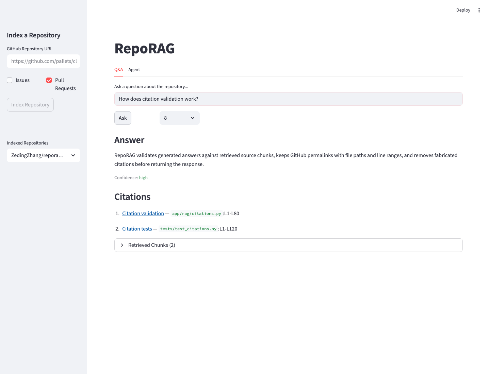
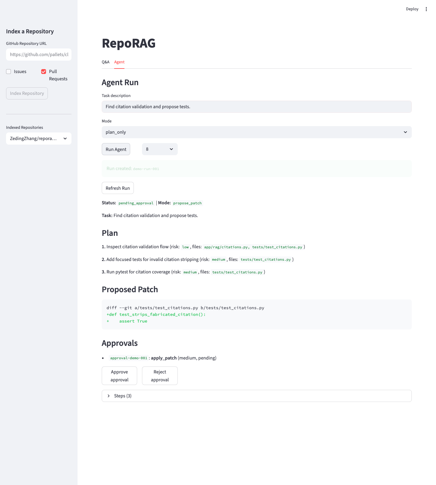
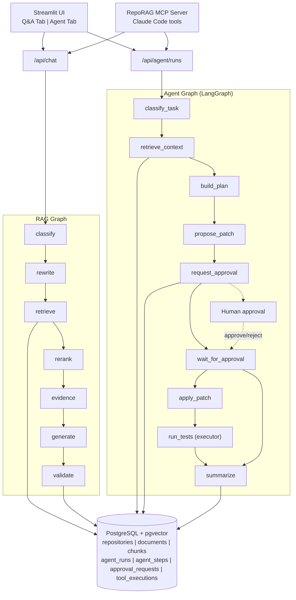

# RepoRAG

[English](README.md) | [中文文档](README.zh.md)

面向 GitHub 仓库的 RAG 智能助手 + 可行动的代码维护 Agent 工作台 — 基于源码的证据型回答、混合检索、LangGraph agent 编排、人工审批、沙箱执行、MCP 工具集成、轨迹评估。

## 核心特性

### RAG 引擎
- **代码感知分块** — Markdown 按标题切分，Python 按 AST 函数/类切分，JS/TS 正则 fallback，保留行号和 commit SHA
- **混合检索** — 向量（pgvector）+ 关键词（PostgreSQL 全文检索），Reciprocal Rank Fusion 融合
- **引用验证** — 回答带 GitHub permalink（文件路径+行号），自动检测并剔除伪造引用
- **LangGraph RAG 管线** — 问题分类 → 查询改写 → 混合检索 → 重排序 → 证据检查 → 生成 → 校验

### Agentic 扩展
- **LangGraph agent 工作流** — 分类任务 → 检索上下文 → 构建计划 → 生成 patch → 请求审批 → 执行/汇总
- **人工审批** — 高风险操作（apply_patch、run_command、create_pr）必须显式审批
- **安全守卫** — CommandGuard（allowlist: pytest/ruff/python；拦截 rm/sudo/curl/ssh + shell 元字符），PathGuard（拦截 .env/.git/credentials + 目录穿越）
- **安全执行** — `subprocess.run` 无 `shell=True`，60s timeout，stdout/stderr 捕获，ToolExecution 审计日志
- **Patch 提案** — LLM 生成 unified diff，自动校验 diff 格式合法性
- **MCP 服务** — 4 个工具（search_code、create_agent_run、get_agent_run、resolve_approval），可接入 Claude Code
- **Agent 评估** — plan_success、context_hit_rate、approval_accuracy、patch_validity、latency

## 运行截图

### Q&A 引用回答


### Agent 审批工作流


## 架构



## Agent Workflow（LangGraph）

```
classify_task ──► retrieve_context ──► build_plan
                                          │
                   plan_only ──► summarize ◄── approved/rejected
                   propose_patch / execute ──► propose_patch
                                                  │
                                            request_approval
                                                  │
                              not_required ──► summarize
                              pending ──► wait_for_approval ──► END
                              approved ──► apply_patch ──► run_tests ──► summarize
```

## 安全与审批模型

| 风险等级 | 示例 | 需要审批 |
|----------|------|----------|
| Low | 只读检索、查看 repo 列表 | 否 |
| Medium | pytest、ruff check | 是（execute 模式下） |
| High | apply patch、rm、curl、git push、create PR | 是 |

**CommandGuard 拦截**：`rm`、`sudo`、`curl`、`wget`、`ssh`、`nc`、`chmod`、`chown`、`git push`、`git reset --hard`、shell 元字符（`|`、`;`、`&&`、`$()`、`` ` ``、`>`、`<`）

**PathGuard 拦截**：`.env`、`.git/`、credentials 文件、目录穿越（`..`）

## 技术栈

| 层级 | 技术 |
|------|------|
| 后端 | Python 3.11+, FastAPI |
| RAG/Agent | LangChain（langchain-openai, langchain-core）, LangGraph |
| 数据库 | PostgreSQL + pgvector（+ 全文检索） |
| 前端 | Streamlit（Q&A + Agent 双 tab） |
| 大模型 | DeepSeek V4（OpenAI-compatible，可替换） |
| Embedding | OpenAI-compatible provider（可替换） |
| MCP | FastMCP（Python >=3.10） |
| 开发工具 | pytest（159 tests）, ruff, Alembic |

## 快速开始

```bash
git clone https://github.com/ZedingZhang/reporag.git
cd reporag
cp .env.example .env           # 填入 API Key
docker compose up --build       # 自动执行 migration
```

- FastAPI 文档：http://localhost:8000/docs
- Streamlit 界面：http://localhost:8501

## API

### RAG 端点
| 方法 | 路径 | 说明 |
|------|------|------|
| POST | `/api/repos/index` | 索引 GitHub 仓库（异步后台） |
| POST | `/api/chat` | 提问，返回带引用回答 |
| GET | `/api/repos` | 列出已索引仓库 |
| GET | `/api/repos/{id}/status` | 查询索引状态 |

### Agent 端点
| 方法 | 路径 | 说明 |
|------|------|------|
| POST | `/api/agent/runs` | 创建 agent run |
| GET | `/api/agent/runs/{id}` | 查看 run（plan、patch、审批、steps） |
| GET | `/api/agent/runs/{id}/steps` | 列出 run steps |
| POST | `/api/agent/runs/{id}/continue` | 审批后恢复执行 |
| POST | `/api/agent/runs/{id}/cancel` | 取消 run |
| POST | `/api/agent/approvals/{aid}/resolve` | 审批通过/驳回 |

## MCP 集成

```bash
# 本地安装 MCP SDK（需要 Python >=3.10）
python3 -m pip install -e ".[mcp]"

# 启动 MCP server
python3 -m app.mcp.server

# 或配置 Claude Code 自动启动：
cp .mcp.example.json ~/.claude/mcp.json  # 填入 API Key
```

Claude Code 可调用：`search_code`、`create_agent_run`、`get_agent_run`、`resolve_approval`

## 评估

### RAG 评估
```bash
python scripts/evaluate.py --dataset examples/eval_dataset.jsonl
```
指标：Recall@5、MRR、引用覆盖率、延迟。

### Agent 评估
```bash
python scripts/evaluate_agent.py --dataset examples/agent_tasks.jsonl
```
指标：plan_success、context_hit_rate、approval_accuracy、patch_validity、avg_latency。

## 项目结构

```
app/
  core/          配置、日志、Provider Adapter（ChatOpenAI, OpenAIEmbeddings）
  db/            SQLAlchemy 模型（7 张表）、Alembic migration
  github/        GitHub REST API 客户端
  ingestion/     切片器（Markdown、Python AST、JS/TS）、Embedding 客户端
  retrieval/     向量检索、关键词检索、混合融合、Reranker
  rag/           LangGraph RAG 管线、Prompt、引用校验
  agent/         LangGraph agent 工作流、State、Prompt、Service
  tools/         repo_context、patch、executor
  security/      CommandGuard、PathGuard、ApprovalPolicy、ApprovalManager
  mcp/           FastMCP server（Claude Code 接入）
  api/           FastAPI 路由（RAG + Agent）
streamlit_app/   Q&A tab + Agent tab
scripts/         ingest_repo、evaluate、evaluate_agent
tests/           159 个 pytest 测试
```

## 简历亮点

> 独立完成 RepoRAG，一个面向 GitHub 仓库的 RAG 助手 + agentic 代码维护工作台。实现了代码感知切片、混合检索+RRF 融合、引用校验、LangGraph RAG 管线，并扩展了 LangGraph agent 编排、MCP 工具集成、人工审批、沙箱命令执行、轨迹评估等多维度 agent 工程能力。

> 设计了安全的 agent 工具层：schema-validated tools、PathGuard/CommandGuard、高风险操作审批门禁、eval 指标覆盖 context hit rate、patch validity、unsafe-command blocking、latency、tool-call count。

## Roadmap

- [x] 代码感知分块（Markdown、Python AST、JS/TS）
- [x] 混合检索 + RRF 融合
- [x] 引用校验 + GitHub permalink
- [x] 后台异步索引
- [x] LangGraph RAG 管线
- [x] Agent graph（分类 → 计划 → patch → 审批 → 执行）
- [x] 审批系统 + 安全守卫
- [x] 安全命令执行
- [x] MCP server 接入 Claude Code
- [x] Agent 评估框架
- [ ] Cross-encoder 重排序
- [ ] 多仓库交叉检索
- [ ] Next.js + shadcn/ui 前端
